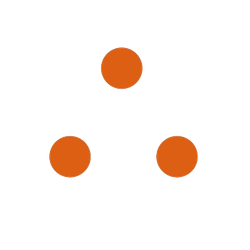

<div style="display: flex; justify-content: center; align-items: center;">
  
  <h1 style="margin-left: 0.5rem">Real Assist</h1>
</div>

**Real Assist** is a RealPage AI chat assistant for new hires to get all company information like policies, links, contact details etc at their finger tips. Running on open source Ollama with mistral LLM(Large language model).

# Features ✨

- **Beautiful & intuitive UI:** Chat GPT like UI.
- **Code syntax highligting:** Messages that include code, will be highlighted for easy access.
- **Copy codeblocks easily:** Easily copy the highlighted code with one click.
- **Chat history:** Chats are saved and easily accessed.
- **Light & Dark mode:** Switch between light & dark mode.

# Requisites ⚙️

To use the web interface, these requisites must be met:

1. Download [Ollama](https://ollama.com/download) and have it running. Or run it in a Docker container. Check the [docs](https://github.com/ollama/ollama) for instructions.
2. Pull one of Ollama model from the library [Models](https://ollama.com/library). Check the [docs](https://github.com/ollama/ollama) for instructions.
3. Node.js (18+) and npm is required. [Download](https://nodejs.org/en/download)

# Installation 📖

Clone the repository to a directory and follow the below steps.

**1. Open the folder:**

```
cd nextjs-ollama-llm-ui
```

**2. Rename the `.example.env` to `.env`:**

```
mv .example.env .env
```

**3. If your instance of Ollama is NOT running on the default ip-address and port, change the variable in the .env file to fit your usecase:**

```
NEXT_PUBLIC_OLLAMA_URL="http://localhost:11434"
NEXT_PUBLIC_OLLAMA_MODEL="mistral"
```

**4. Install dependencies:**

```
npm install
```

**5. Start the development server:**

```
npm run dev
```

**6. Go to [localhost:3000](http://localhost:3000) and start chatting with your favourite model!**

<!-- 
# Upcoming features

This is a to-do list consisting of upcoming features.
- ⬜️ Ability to send an image in the prompt to utilize vision language models.
- ⬜️ Ability to regenerate responses
- ⬜️ Import and export chats
- ⬜️ Voice input support
- ✅ Code syntax highlighting -->

# Tech stack

[NextJS](https://nextjs.org/) - React Framework for the Web

[TailwindCSS](https://tailwindcss.com/) - Utility-first CSS framework

[shadcn-ui](https://ui.shadcn.com/) - UI component built using Radix UI and Tailwind CSS

[shadcn-chat](https://github.com/jakobhoeg/shadcn-chat) - Chat components for NextJS/React projects

[Framer Motion](https://www.framer.com/motion/) - Motion/animation library for React

[Lucide Icons](https://lucide.dev/) - Icon library

